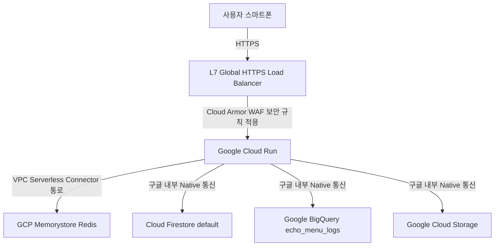

# Infrastructure System Architecture (infra.md)

본 문서는 Echo-Menu 3.0이 배포되어 실서비스를 전개하는 Google Cloud Platform (GCP) 인프라 구성 및 네트워크/보안 경로에 관한 상세 설계서입니다.

---

## 🏗️ 1. GCP 서버리스 인프라 토폴로지 (Serverless Infrastructure Topology)

모든 인프라 자원은 **Scale-to-Zero(사용량 기반 과금)**가 가능한 완벽한 서버리스 제품군으로 구성되어 있습니다. 요청이 평시에는 0원(과금 없음)으로 수렴하며 해커톤 무료 크레딧을 극한으로 세이빙합니다.

---

## 🛡️ 2. 3단계 WAF/DDoS 비용 보안 경계 설계

비정상적인 트래픽 난사 및 매크로 공격이 백엔드 컨테이너의 CPU를 소모시켜 요금 폭탄을 발생시키는 것을 로드밸런서 선단에서 원천 차단합니다.

### 2-1. Google Cloud Armor WAF
* **규칙 정의:** `rate-based-ban` 임계치 수립.
* **임계값:** 단일 소스 IP 주소 기준 **1분당 최대 60회** 호출 초과 시, WAF 에지 스위치에서 트래픽을 즉각 차단하고 `429 Too Many Requests` 상태 코드로 즉시 밀어냅니다.
* **차단 지속 시간:** 규칙에 걸린 IP는 5분(300초)간 강제 차단 리스트에 임시 격리하여 Cloud Run 인스턴스 부하를 0%로 통제합니다.

### 2-2. Serverless VPC Access Connector
* Cloud Run 컨테이너와 Memorystore Redis 간의 다이렉트 패킷 전달을 보호하기 위해, 서울 리전(asia-northeast3)에 `10.8.0.0/28` 대역의 **VPC Connector**를 개설하여 전용 사설 통로를 생성하고 외부 접근을 영구 격리합니다.

---

## 🗄️ 3. 데이터베이스 및 빅데이터 파이프라인 (Firestore, BigQuery)

### 3-1. Cloud Firestore (Native Mode)
* 스키마 제약이 전혀 없는 서버리스 NoSQL default 데이터베이스로서 서울 리전에 활성화합니다.
* 매장별로 카테고리와 Bounding Box 좌표 구조가 상이한 메뉴판 템플릿 JSON 구조를 마이그레이션 DDL 리스크 없이 즉석 도큐먼트로 밀어 넣어 자가 성장 DB(Self-Growing)의 동적인 누적을 가동합니다.

### 3-2. BigQuery & Looker Studio
* 기여 히스토리 및 이용 오프셋 통계 로그를 BigQuery의 `frame_analysis_history` 테이블에 즉석 스트리밍 인서트합니다.
* `Looker Studio`에서 BigQuery 테이블 데이터를 드래그 앤 드롭으로 랭킹 명예의 전당 보드로 디자인한 뒤, iframe 태그를 통해 `index.html` 하단에 모바일 웹 임베딩시킵니다.
